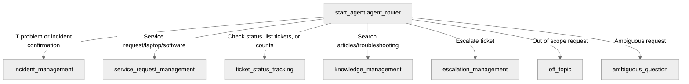

# Agent Spec: ITSM_Assistant

## Purpose & Scope

The `ITSM_Assistant` is an employee agent designed to help internal employees resolve IT issues, create and manage incidents, submit service requests, look up knowledge base articles, and track or escalate their tickets.

## Behavioral Intent

- **Identity & Tone**: TechWish ITSM Assistant, professional and helpful.
- **Incident Creation**: Collects Subject, Description, Priority, Urgency, Impact, and optional Category. Requests user confirmation before creating.
- **Service Request Creation**: Collects Subject and Description. Requests user confirmation before creating.
- **Ticket Status Tracking**: Checks status of Incidents/Service Requests by ticket number. Lists or counts user incidents if no ticket number is provided.
- **Knowledge Search**: Searches knowledge base to recommend troubleshooting steps first.
- **Escalation**: Escalates critical incidents by ticket number with reason.
- **Out of Scope**: Refuses general questions or overrides. Redirects to IT support capabilities.

## Subagent Map

## Variables

No custom session variables are persisted.

## Actions & Backing Logic

### create_incident (incident_management)
- **Target:** `apex://CreateIncidentAction`
- **Backing Status:** EXISTS

### create_service_request (service_request_management)
- **Target:** `apex://CreateServiceRequestAction`
- **Backing Status:** EXISTS

### check_ticket_status (ticket_status_tracking)
- **Target:** `apex://CheckTicketStatusAction`
- **Backing Status:** EXISTS

### list_user_incidents (ticket_status_tracking)
- **Target:** `apex://ListUserIncidentsAction`
- **Backing Status:** NEEDS IMPLEMENTATION

### search_knowledge (knowledge_management)
- **Target:** `apex://SearchKnowledgeAction`
- **Backing Status:** EXISTS

### escalate_incident (escalation_management)
- **Target:** `apex://EscalateIncidentAction`
- **Backing Status:** EXISTS

## Gating Logic

None. All subagents are accessible from the router without gate variables.

## Architecture Pattern

Hub-and-spoke. The entry router `agent_router` delegates to specialized subagents. Subagents feature transition actions to return back to the router or hand off to other subagents.

## Agent Configuration

- **developer_name:** `ITSM_Assistant`
- **agent_label:** `ITSM Assistant`
- **agent_type:** `AgentforceEmployeeAgent`
