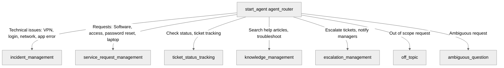

# Agent Spec: IT_Support_Copilot

## Purpose & Scope

The `IT_Support_Copilot` is an employee agent designed to act as an IT Help Desk assistant for internal employees. It manages incidents (technical issues), service requests (access, software, hardware requests), knowledge base searches, ticket tracking, and ticket escalation.

## Behavioral Intent

- **Identity & Tone**: IT Support Copilot, professional and helpful.
- **Incident Creation**:
  - Collects Subject, Description, Category, Urgency, Impact, and optional fields (Requester Email, SubCategory, Type).
  - Automatically determines Priority from Impact and Urgency.
  - Confirms details before record creation.
  - Populates status as "New" and ReportedById as current user.
  - Returns and displays the Incident Number after successful creation.
- **Service Request Creation**:
  - Collects Subject, Description, Priority, and optional Requester Email.
  - Supports types: Software Installation, VPN Access, Application Access, Password Reset, New Hardware Request, Email Access.
  - Confirms details before creation.
  - Returns and displays the Service Request Number after successful creation.
- **Knowledge Search**:
  - Searches Salesforce Knowledge Articles.
  - Recommends knowledge articles for troubleshooting before ticket creation.
- **Ticket Status**:
  - Searches Incident by Incident Number or Service Request by Service Request Number.
  - Returns: Status, Priority, Assigned User, Assigned Group, Last Modified Date.
- **Escalation**:
  - Escalate unresolved tickets or critical incidents.
  - Updates Priority to Critical and notifies support teams when Priority is High/Critical.
- **Handling Errors**: Graces errors by displaying clear error messages.

## Subagent Map

## Variables

No custom session variables are persisted.

## Actions & Backing Logic

### create_incident (incident_management)
- **Target:** `apex://CopilotCreateIncidentAction`
- **Backing Status:** EXISTS

### create_service_request (service_request_management)
- **Target:** `apex://CopilotCreateServiceRequestAction`
- **Backing Status:** NEEDS IMPLEMENTATION

### check_ticket_status (ticket_status_tracking)
- **Target:** `apex://CopilotCheckTicketStatusAction`
- **Backing Status:** NEEDS IMPLEMENTATION

### search_knowledge (knowledge_management)
- **Target:** `apex://CopilotSearchKnowledgeAction`
- **Backing Status:** NEEDS IMPLEMENTATION

### escalate_ticket (escalation_management)
- **Target:** `apex://CopilotEscalateTicketAction`
- **Backing Status:** NEEDS IMPLEMENTATION

## Gating Logic

None. All subagents are accessible from the router without gate variables.

## Architecture Pattern

Hub-and-spoke. The entry router `agent_router` delegates to specialized subagents. Subagents feature transition actions to return back to the router or hand off to other subagents.

## Agent Configuration

- **developer_name:** `IT_Support_Copilot`
- **agent_label:** `IT Support Copilot`
- **agent_type:** `AgentforceEmployeeAgent`
